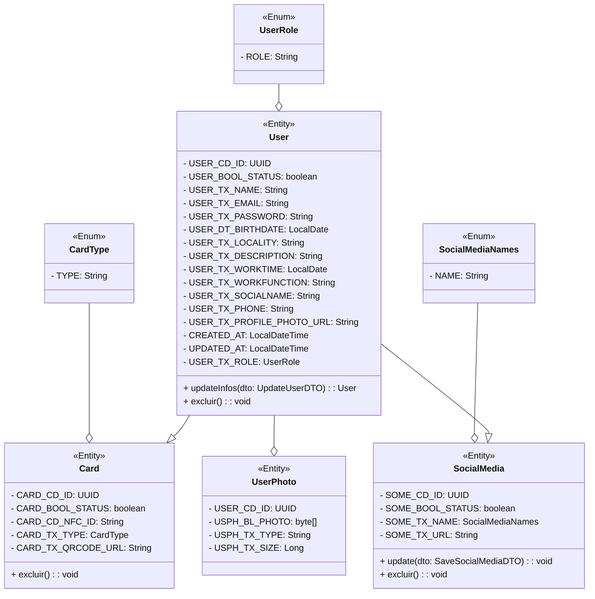

# Projeto NekiCard


<p align="center"> Aplicativo e site para comunicação entre funcionários utilzando o NekiCard </p>

# 🛠 Tecnologias Utilizadas

- React
- React Native
- Expo
- Spring Boot
- Tailwind css
- Shadcn/ui
- TypeScript
- Native Base
- React Hook Form
- Yup
- Spring Security
- Tokens JWT
- Lombok
- Docker
- Github Actions
- Neon DB
- Figma

# 🎯 Objetivo Principal

O principal objetivo deste projto foi a criação de um site, aplicativo e API completa durante uma semana para a facilitar a comunicação dos colaboradores; Além disso foi implentado um fluxo de CI/CD Utilizando Docker, Github Actions, Render, Neon DB e Vercel.

## 📄 Documentação e casos de Uso
[Link para a documentação](https://github.com/Arawns1/NekiCard/tree/main/docs)

## 🎲 Modelagem do Banco de Dados



# 📸 Visuais e Telas
🎨 [Link para o figma](https://www.figma.com/file/Uh49GkN8efqS4LLaptQOgB/Testes?type=design&node-id=1%3A3&mode=design&t=u1a0WA6YX6nzMndj-1)


## 💻 Como Rodar?

1. Clone o repositório
```bash
git clone https://github.com/Arawns1/NekiCard.git
```
2. Utilize o docker compose para subir a instancia de Banco de dados e API
```bash
    docker-compose up -d
```
3. Entre no diretório e rode
```bash
  npm install 
```
4. Altere o arquivo .ENV para o url de sua API para ```http://localhost:8082/```


5. Rode o projeto
```bash
  npm run dev
```
Por padrão o projeto web possui apenas a rota /user/{userId} que busca os dados do usuário
